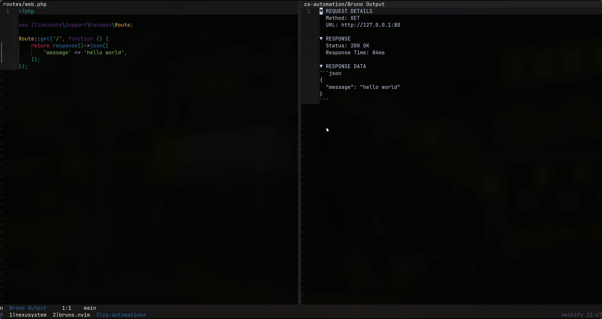
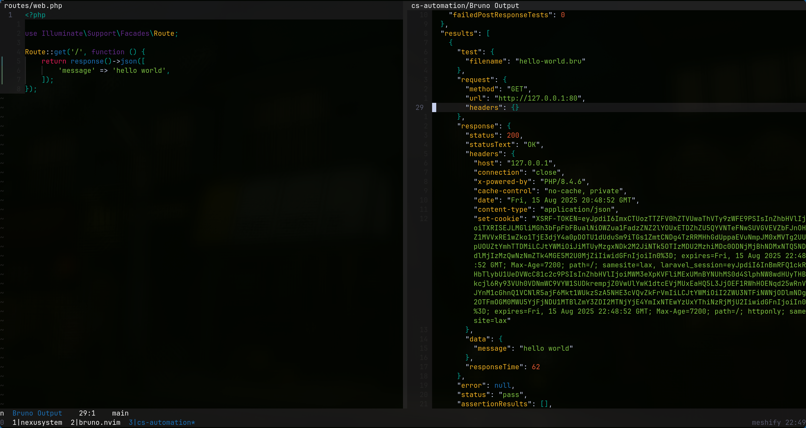
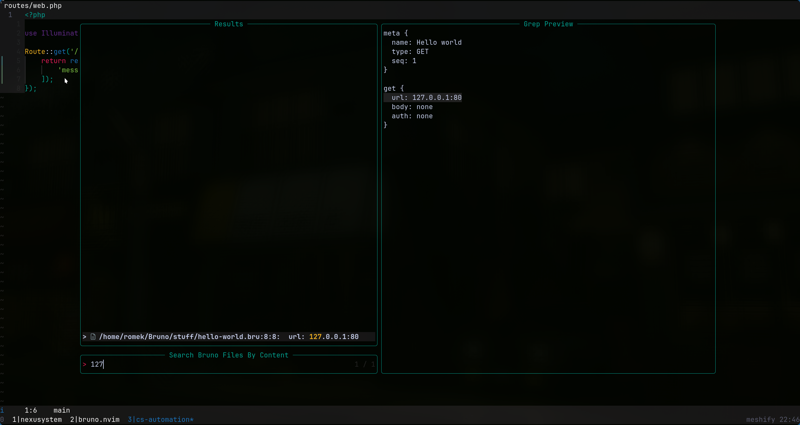
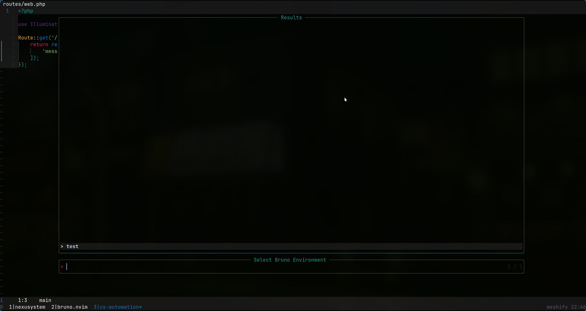

# bruno.nvim

# Features:

- **Execute Bruno requests** - Run `.bru` files directly from Neovim
- **Smart fallback** - Uses last opened `.bru` file when current buffer isn't a Bruno file
- **Environment switching** - Select Bruno environments via a picker (`telescope`, `fzf-lua`, or `snacks`)
- **Formatted output** - Clean response display with request details and JSON formatting
- **Output toggle** - Switch between formatted and raw JSON output
- **Content search** - Search Bruno files by their contents using your chosen picker
- **Persistent sidebar** - Reuses output buffer to avoid window clutter

## Screenshots:
 

 

# Installation

Make sure you have [Bruno CLI](https://docs.usebruno.com/bru-cli/overview) installed.

```bash
npm install -g @usebruno/cli
```

Can also be installed from [nixpkgs](https://search.nixos.org/packages?channel=unstable&query=bruno-cli).

### lazy.nvim

```lua
{
	"romek-codes/bruno.nvim",
    dependencies = {
        "nvim-lua/plenary.nvim",
        -- Pickers
        -- Choose one based on whichever picker you prefer.
        "nvim-telescope/telescope.nvim",
        -- Or
        -- "ibhagwan/fzf-lua",
        -- Or
        -- {
        --     "folke/snacks.nvim",
        --     opts = { picker = { enabled = true } },
        -- },
    },
	config = function()
		require("bruno").setup(
            {
                -- Paths to your bruno collections.
                collection_paths = {
                    { name = "Main", path = "/path/to/folder/containing/collections/Documents/Bruno" },
                }, 
                -- Which picker to use, "fzf-lua" or "snacks" are also allowed.
                picker = "telescope", 
                -- If output should be formatted by default.
                show_formatted_output = true, 
                -- If formatting fails for whatever reason, don't show error message (will always fallback to unformatted output).
                suppress_formatting_errors = false
            }
        )
	end
}
```

# Usage:
### Run currently opened .bru file

:BrunoRun

### Search through bruno environments

:BrunoEnv

### Search for .bru files

:BrunoSearch

### Toggle bruno-cli output formatting

:BrunoToggleFormat
